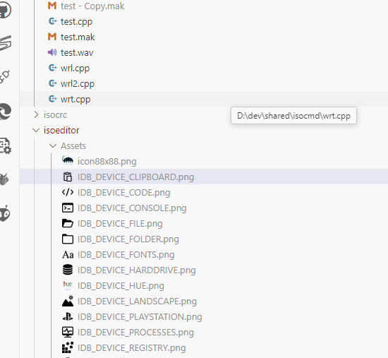

# Thumbnail Icons

This extension provides creates thumbnails and uses them as file icons.

## More Information
This is a horrible hack, and abuse of the vscode API.

When enabled, the workspace is scanned, thumbnails are generated, and the theme is rewritten. All generated icons must be stored within the extension, so there is a lot of opportunity for clashes if you have a file in two different workspaces with the same name.

You *may* need to reload the window after selecting this theme.

These are the currently supported file types:
- svg
- png
- jpg
- gif

## What's New
I now copy the previously set file-icon-theme into this theme before generating the additional thumbnail icons. This should preserve the existing icons for files that do not generate thumbnails.

To change the theme of these fallback icons, switch to that theme and then back to this Thumbnail theme.

## Author
Adrian Stephens

